## **Following course video**

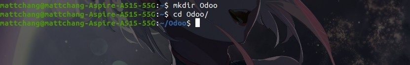

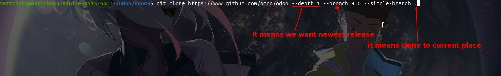

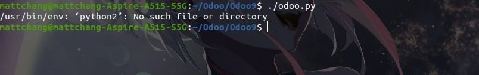

- In a later review, I found that this course is 7 years old, and although the catalog has model, view, template these things, but the code part is very few.

## **Following AI suggections to install Odoo14**

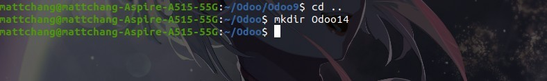

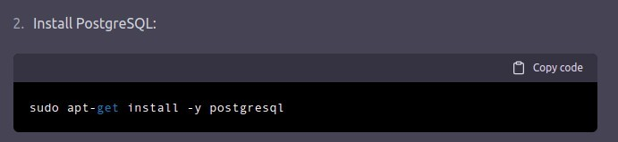

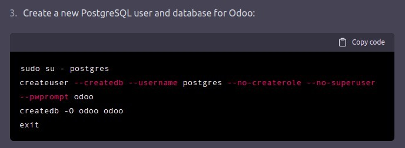

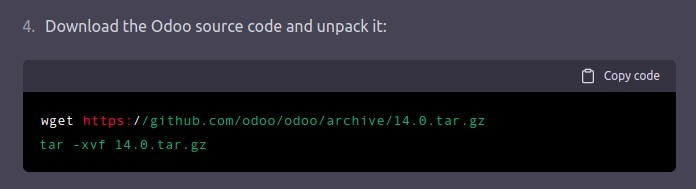

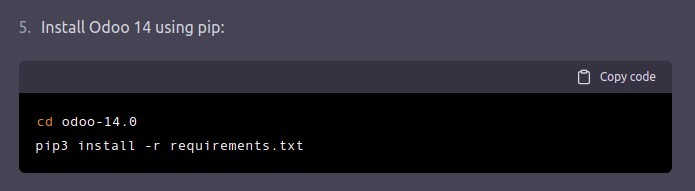

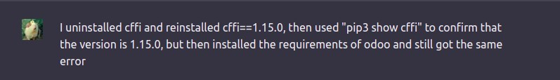

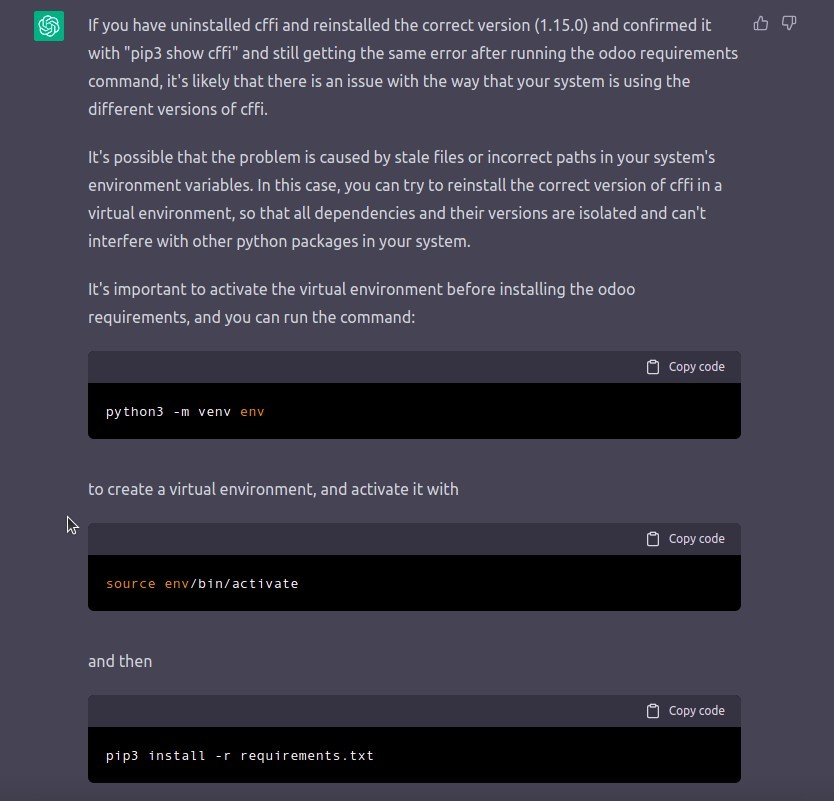

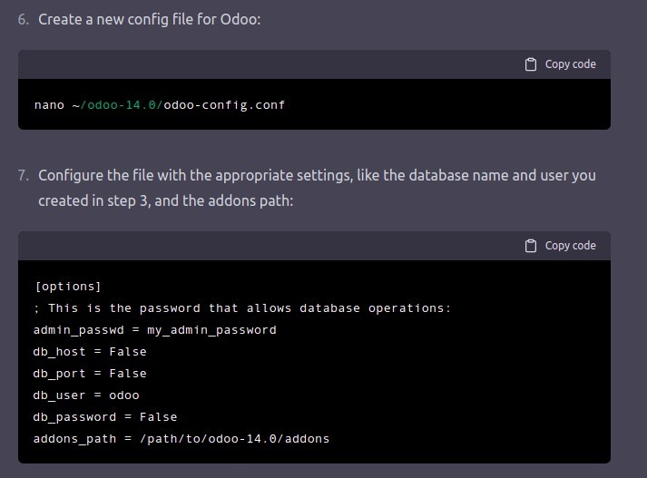

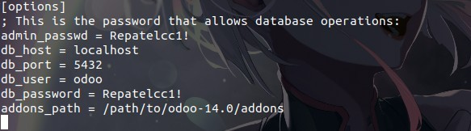

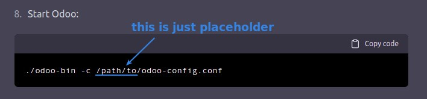

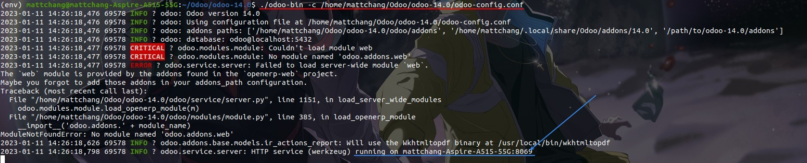

## **Following official documents to install Newest Odoo**

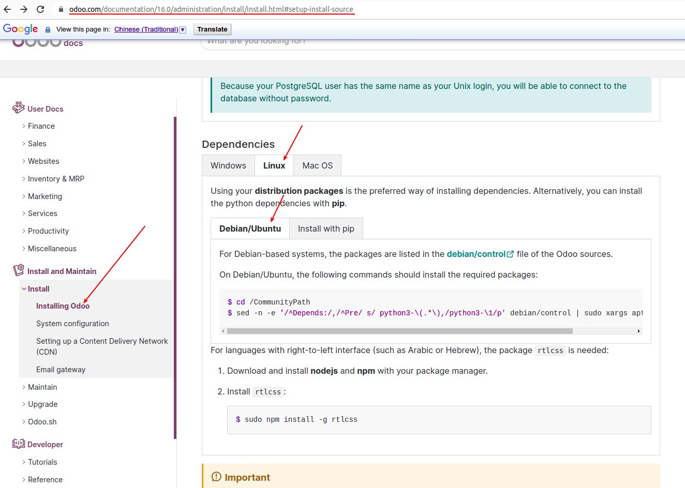

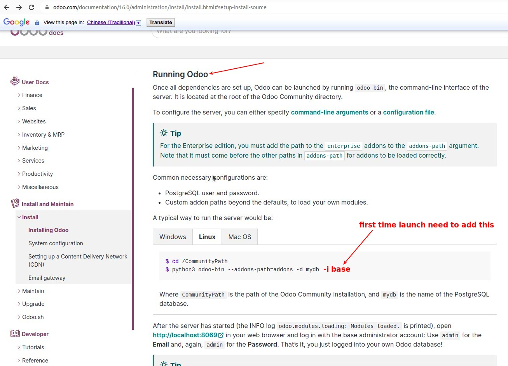
